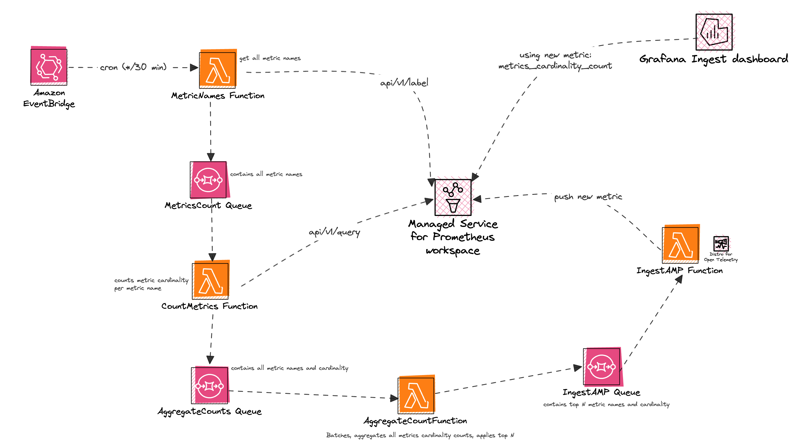

# Amazon Managed Service for Prometheus - Cardinality insights

This project helps you have visibility into high cardinality metrics from an
Amazon Managed Service for Prometheus workspace.

## Support & Feedback

**Amazon Managed Service for Prometheus - Cardinality insights** is maintained
by AWS Solution Architects. It is not part of an AWS service and support is
provided as best-effort by the community.

To post feedback, submit feature ideas, or report bugs, please use the Issues
section of this GitHub repo.

If you are interested in contributing, see the Contribution guide.

## How it works

This project proposes a serverless solution that you deploy and operate on your
account. You give read/write permissions to your workspace and:

- Every 30 min (default, adjustable), it queries your workspace for insights
- Writes a new metric `amp_cardinality_insights` back into your workspace
- You can then query this metric for insights, through an optimized Grafana
dashboard that we provide

## Architecture



## Costs

- **Scenario 1**: ~75k active series workspace, Amazon EventBridge cron running
every 30 min, 1410 metric names costs $1.28 per month (SQS $1.24 + Lambda $0.04)

- **Scenario 2**: ~30M active series workspace, Amazon EventBridge cron running
every 30 min, 2653 metric names costs $3.20 per month (SQS $2.79 + Lambda $0.41)

## Deploy

To deploy make sure to have the following pre-requisites:

- [awscli v2](https://docs.aws.amazon.com/cli/latest/userguide/getting-started-install.html)
- [aws sam](https://docs.aws.amazon.com/serverless-application-model/latest/developerguide/install-sam-cli.html)
- IAM permissions to deploy/delete: CloudFormation, Lambda, SQS, EventBridge, create IAM Roles
- A prometheus workspace
- Not required to deploy, but you will need a Grafana environment for visualization

```console
./deploy.sh REGION PROMETHEUS_WORKSPACE_ID
```

## Import Grafana dashboard

- [Create an Amazon Managed Grafana Workspace](https://docs.aws.amazon.com/grafana/latest/userguide/AMG-create-workspace.html)
- Setup your Amazon Managed Service for Prometheus data source
- Import the JSON [Grafana dashboard](./dashboard/dashboard.json)
- Click on a metric to have visibility into the cardinality details
- Explore which cardinalities can be reduced


## Lambda permissions

To manually provide IAM roles to the Lambda functions, use these environment
variables below. You can see the minimum permissions required for each function:

### `METRIC_NAMES_FUNCTION_ROLE_ARN`

- Lambda basic execution role

`arn:aws:iam::aws:policy/service-role/AWSLambdaBasicExecutionRole`

- SQS permissions

```json
{
    "Statement": [
        {
            "Action": [
                "sqs:SendMessage*"
            ],
            "Resource": "amp-cardinality-insights-MetricsCountQueue ARN",
            "Effect": "Allow"
        }
    ]
}
```

- AMP read permissions

```json
{
    "Statement": [
        {
            "Action": [
                "aps:GetSeries",
                "aps:GetLabels",
                "aps:GetMetricMetadata",
                "aps:QueryMetric"
            ],
            "Resource": "workspace ARN",
            "Effect": "Allow",
            "Sid": "AMPRead"
        }
    ]
}
```

- STS

Used to sign AMP queries

```json
{
    "Statement": [
        {
            "Action": [
                "sts:GetSessionToken",
                "sts:GetCallerIdentity"
            ],
            "Resource": "*",
            "Effect": "Allow",
            "Sid": "STS"
        }
    ]
}
```

### `COUNT_METRICS_FUNCTION_ROLE_ARN`

- Lambda basic execution role

`arn:aws:iam::aws:policy/service-role/AWSLambdaBasicExecutionRole`

- SQS polling permissions

`arn:aws:iam::aws:policy/service-role/AWSLambdaSQSQueueExecutionRole`

- SQS permissions

```json
{
    "Statement": [
        {
            "Action": [
                "sqs:ChangeMessageVisibility",
                "sqs:ChangeMessageVisibilityBatch",
                "sqs:DeleteMessage",
                "sqs:DeleteMessageBatch",
                "sqs:GetQueueAttributes",
                "sqs:ReceiveMessage"
            ],
            "Resource": "amp-cardinality-insights-MetricsCountQueue ARN",
            "Effect": "Allow"
        },
        {
            "Action": [
                "sqs:SendMessage*"
            ],
            "Resource": "amp-cardinality-insights-AggregateCountsQueue ARN",
            "Effect": "Allow"
        }
    ]
}
```

- AMP read permissions

```json
{
    "Statement": [
        {
            "Action": [
                "aps:GetSeries",
                "aps:GetLabels",
                "aps:GetMetricMetadata",
                "aps:QueryMetric"
            ],
            "Resource": "workspace ARN",
            "Effect": "Allow",
            "Sid": "AMPRead"
        }
    ]
}
```

- STS

Used to sign AMP queries

```json
{
    "Statement": [
        {
            "Action": [
                "sts:GetSessionToken",
                "sts:GetCallerIdentity"
            ],
            "Resource": "*",
            "Effect": "Allow",
            "Sid": "STS"
        }
    ]
}
```

### `AGGREGATE_COUNT_FUNCTION_ROLE_ARN`

- Lambda basic execution role

`arn:aws:iam::aws:policy/service-role/AWSLambdaBasicExecutionRole`

- SQS polling permissions

`arn:aws:iam::aws:policy/service-role/AWSLambdaSQSQueueExecutionRole`

- SQS permissions

```json
{
    "Statement": [
        {
            "Action": [
                "sqs:ChangeMessageVisibility",
                "sqs:ChangeMessageVisibilityBatch",
                "sqs:DeleteMessage",
                "sqs:DeleteMessageBatch",
                "sqs:GetQueueAttributes",
                "sqs:ReceiveMessage"
            ],
            "Resource": "amp-cardinality-insights-AggregateCountsQueue ARN",
            "Effect": "Allow"
        },
        {
            "Action": [
                "sqs:SendMessage*"
            ],
            "Resource": "amp-cardinality-insights-IngestAMPQueue ARN",
            "Effect": "Allow"
        }
    ]
}
```

### `INGEST_AMP_FUNCTION_ROLE_ARN`

- Lambda basic execution role

`arn:aws:iam::aws:policy/service-role/AWSLambdaBasicExecutionRole`

- SQS polling permissions

`arn:aws:iam::aws:policy/service-role/AWSLambdaSQSQueueExecutionRole`

- AMP Remote write

`arn:aws:iam::aws:policy/AmazonPrometheusRemoteWriteAccess`

- SQS permissions

```json
{
    "Statement": [
        {
            "Action": [
                "sqs:ChangeMessageVisibility",
                "sqs:ChangeMessageVisibilityBatch",
                "sqs:DeleteMessage",
                "sqs:DeleteMessageBatch",
                "sqs:GetQueueAttributes",
                "sqs:ReceiveMessage"
            ],
            "Resource": "amp-cardinality-insights-IngestAMPQueue ARN",
            "Effect": "Allow"
        }
    ]
}
```

## Teardown

```
sam delete
# stack name should be amp-cardinality-insights
```
